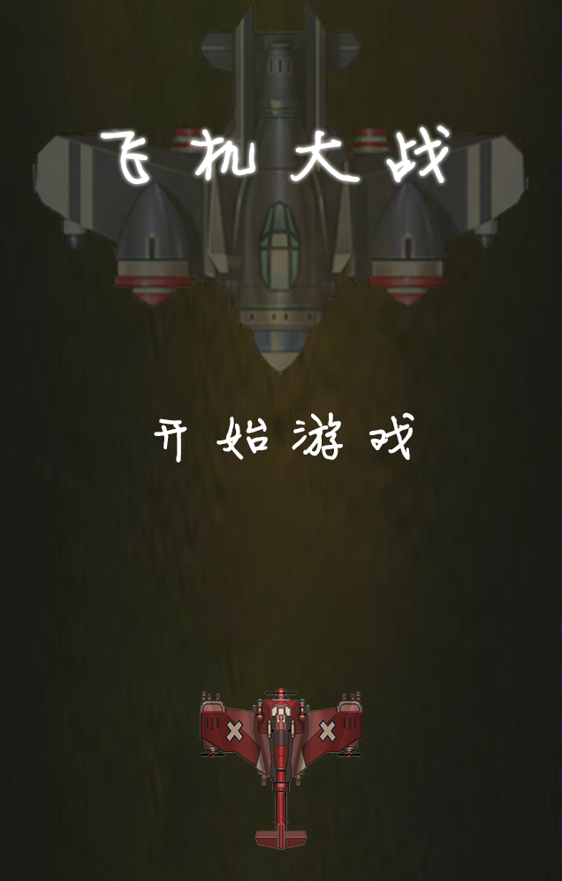
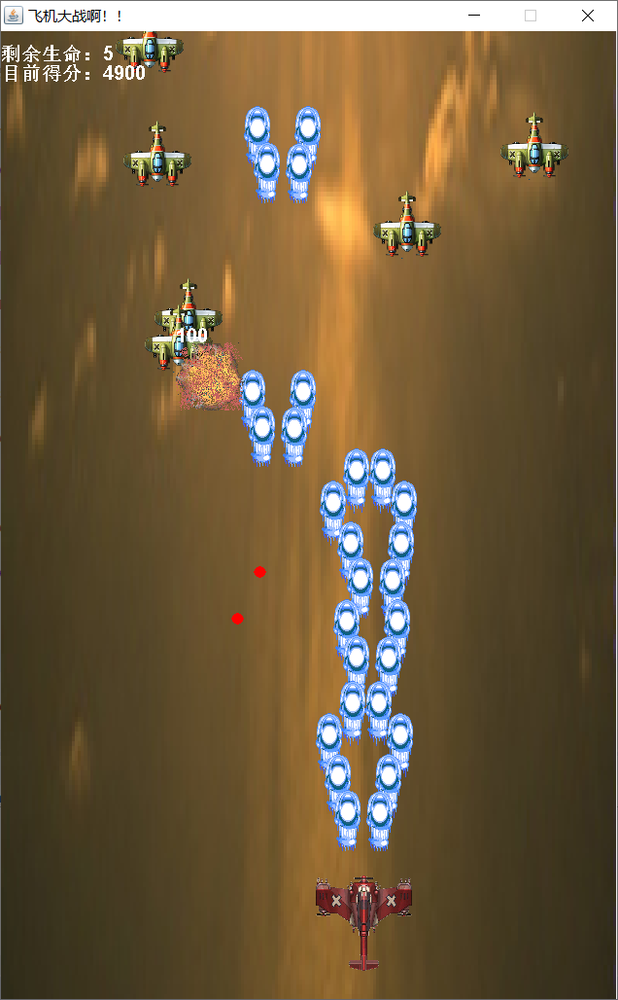
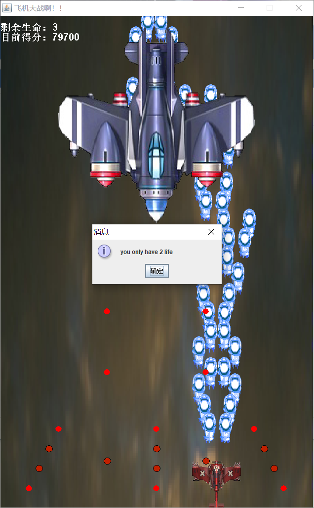

# 飞机大战

## 游戏截图

开始界面

游戏场景

关底boss和死亡

## 游戏设定

> 本游戏仅为练手，故只设计了一关，一个boss，以实现大部分功能为目标

游戏开始时可选择难度，共三档： 简单 一般 困难

飞机自动发射炮弹，敌机从上往下飞行并向角色发射红色弹药，设定上触之即死

玩家共有5条生命，死亡后从中心飞出（此时无敌）并清屏

## 运行配置

java环境，本人使用eclipse编译运行

入口程序是MyFrame.java文件